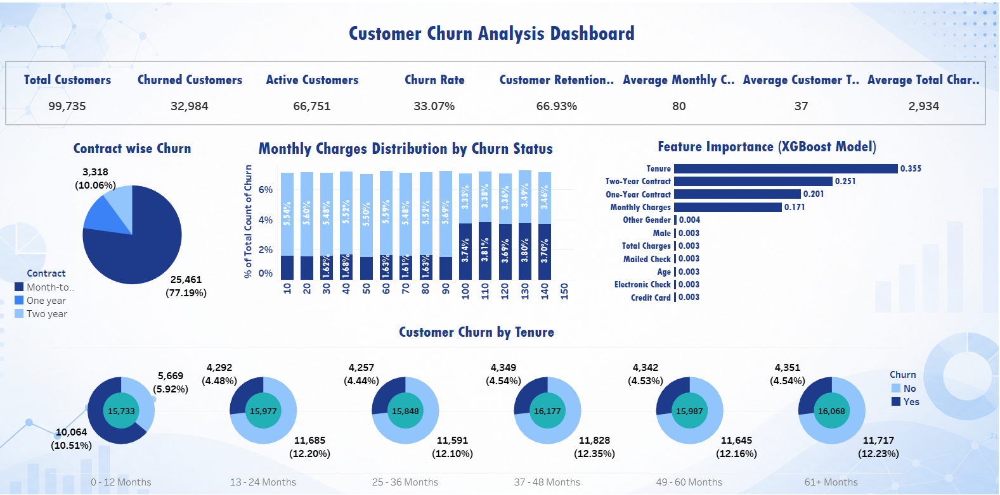

# 📊 Customer Churn Prediction

> **End-to-End Data Science Project using MySQL, Python, Machine Learning (XGBoost), and Tableau**


---

## 📌 Project Overview

Customer churn is one of the biggest challenges faced by subscription-based businesses.

This project demonstrates an **industry-standard end-to-end data science workflow**, starting from SQL database creation to Machine Learning model development and Tableau dashboard visualization.

The project combines:

- SQL Business Analysis
- Data Validation
- Data Cleaning
- Exploratory Data Analysis
- Feature Engineering
- Machine Learning
- Hyperparameter Tuning
- Tableau Dashboard
- Business Recommendations

---

## 📊 Dashboard Preview

> **Interactive Tableau Dashboard**



---

## 🎯 Project Objective

The objective of this project is to:

- Analyze customer behavior using SQL
- Validate and clean business data
- Discover churn patterns through EDA
- Build predictive Machine Learning models
- Compare multiple algorithms
- Identify the most important churn drivers
- Develop an interactive Tableau dashboard
- Provide actionable business recommendations

---

## 🌟 Project Highlights

- ✅ SQL Database Design
- ✅ Data Validation & Quality Assessment
- ✅ Python Data Cleaning Pipeline
- ✅ Exploratory Data Analysis
- ✅ Feature Engineering
- ✅ Machine Learning Model Development
- ✅ Hyperparameter Tuning
- ✅ XGBoost Classification
- ✅ Feature Importance Analysis
- ✅ Model Serialization
- ✅ Tableau Dashboard

---

## 🛠 Tech Stack

| Technology | Purpose |
|------------|---------|
| MySQL | Database & SQL Analysis |
| Python | Data Processing |
| Pandas | Data Manipulation |
| NumPy | Numerical Computing |
| Matplotlib | Data Visualization |
| Seaborn | Statistical Visualization |
| Scikit-learn | Machine Learning |
| XGBoost | Gradient Boosting Classification |
| Tableau | Interactive Dashboard |
| Jupyter Notebook | Development Environment |
| Pickle | Model Serialization |
| Git & GitHub | Version Control |

---

## 📂 Project Structure

```text
Customer-Churn-Prediction
│
├── data
│   ├── raw
│   └── processed
│
├── sql
│
├── notebooks
│
├── models
│
├── reports
│
├── tableau
│   ├── Customer_Churn_Dashboard.twbx
│   └── Customer_Churn_Dashboard.png
│
├── images
│
├── README.md
├── requirements.txt
└── .gitignore
```

---

## 📁 Dataset

| Metric | Value |
|---------|------|
| Dataset | Synthetic Customer Churn Dataset |
| Records | 100,000 |
| Features | 9 |
| Target Variable | Churn |

### Features

- CustomerID
- Age
- Gender
- Tenure
- MonthlyCharges
- Contract
- PaymentMethod
- TotalCharges
- Churn

---

## 📊 Dataset Quality Summary

| Metric | Result |
|---------|---------|
| Total Records | 100,000 |
| Missing Values | 0 |
| Duplicate Records | 0 |
| Negative TotalCharges | 265 (0.27%) |
| Outliers | Present only in TotalCharges |
| Dataset Status | Ready for Machine Learning |

---

## 📈 Exploratory Data Analysis

Performed:

- Univariate Analysis
- Bivariate Analysis
- Correlation Analysis
- Outlier Analysis
- Feature Distribution Analysis
- Churn Pattern Analysis

### Key Findings

- Month-to-month customers showed the highest churn.
- Customers with shorter tenure were more likely to churn.
- Higher monthly charges were associated with higher churn.
- Gender showed minimal influence on churn.

---

## 🤖 Machine Learning

### Data Preprocessing

- Removed CustomerID
- One-Hot Encoding
- Label Encoding
- Standard Scaling
- Train-Test Split (80:20)

### Models Evaluated

- Logistic Regression
- Decision Tree
- Random Forest
- XGBoost
- Tuned XGBoost (GridSearchCV)

### 📊 Model Performance

| Model | Accuracy | ROC-AUC | F1 Score |
|--------|---------:|---------:|----------:|
| **Tuned XGBoost** | **75.95%** | **0.802** | **0.605** |
| XGBoost | 75.31% | 0.797 | 0.592 |
| Random Forest | 73.43% | 0.789 | 0.554 |
| Logistic Regression | 72.48% | 0.771 | 0.525 |
| Decision Tree | 68.15% | 0.641 | 0.521 |

### 🏆 Final Model

Tuned XGBoost was selected as the final model due to its superior performance across Accuracy, ROC-AUC, F1 Score, and Cross-Validation Accuracy.

---

## 📈 Feature Importance

The trained XGBoost model identified the following features as the most influential:

1. Tenure
2. Contract (Two Year)
3. Contract (One Year)
4. Monthly Charges

These variables account for the majority of the model's predictive power, indicating that customer loyalty and contract commitment are the primary drivers of churn.

---

## 📊 Tableau Dashboard

The interactive Tableau dashboard includes:

- KPI Cards
- Contract Type Analysis
- Payment Method Analysis
- Gender vs Churn
- Monthly Charges Distribution
- Customer Churn by Tenure Band
- Feature Importance (XGBoost)

Open the dashboard using:

```text
tableau/Customer_Churn_Dashboard.twbx
```

---

## 💾 Saved Models

The following artifacts are included for future deployment:

- customer_churn_model.pkl
- scaler.pkl
- label_encoder.pkl

---

## 🚀 Installation

```bash
git clone https://github.com/Nihiljohn75/Customer-Churn-Prediction.git

cd Customer-Churn-Prediction

pip install -r requirements.txt
```

---

## ▶️ Run the Project

Run the notebooks in the following order:

```text
01_Data_Cleaning.ipynb

↓

02_EDA.ipynb

↓

03_Machine_Learning.ipynb
```

Then open:

```text
tableau/Customer_Churn_Dashboard.twbx
```

using Tableau Desktop or Tableau Public.

---

## 📈 Business Insights

- Approximately **33.14%** of customers have churned.
- Customer tenure is the strongest predictor of churn.
- Long-term contracts significantly reduce churn.
- Monthly charges play an important role in customer retention.
- Demographic features have relatively little impact compared to behavioral features.

---

## 🔮 Future Improvements

- Deploy the model using Streamlit
- Build a Flask API
- Connect Tableau to a live SQL database
- Add SHAP explainability
- Automate model retraining

---

## 👨‍💻 Author

**Nihil John Sundar S**

📍 Chennai, India

💼 Aspiring Data Scientist

🔗 LinkedIn: https://linkedin.com/in/nihil-john-3bab411b9

💻 GitHub: https://github.com/Nihiljohn75

---

## ⭐ Repository Status

This repository demonstrates an **industry-standard end-to-end Customer Churn Prediction project** covering:

- SQL
- Python
- Exploratory Data Analysis
- Machine Learning
- Hyperparameter Tuning
- XGBoost
- Tableau
- Business Intelligence

It showcases the complete lifecycle of a real-world customer churn prediction workflow, from raw data to actionable business insights.
